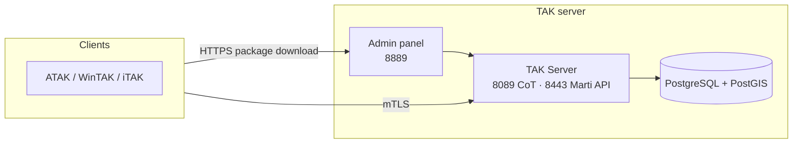

<div align="center">


# TAK Server

Production-style deployment of the official Java TAK Server 5.7, containerized with docker compose, integrated with NetBird for secure overlay networking and managed from the WebUI.

[](https://tak.gov/)
[](https://www.debian.org/)
[](https://www.docker.com/)
[](https://fastapi.tiangolo.com/)
[](https://react.dev/)
[](https://www.postgresql.org/)

[](https://github.com/ndukve/TAK/actions/workflows/shellcheck.yml)
[](https://github.com/ndukve/TAK/actions/workflows/python-lint.yml)
[](https://github.com/ndukve/TAK/actions/workflows/python-tests.yml)
[](https://github.com/ndukve/TAK/actions/workflows/ui-checks.yml)
[](https://github.com/ndukve/TAK/actions/workflows/compose-validate.yml)
[](https://github.com/ndukve/TAK/actions/workflows/release.yml)
[](https://github.com/ndukve/TAK/releases)

</div>

## Overview



This repo holds a self-contained deployment: the official TAK Server binary, a custom admin panel for day-to-day operation, and the scripts that install/update/back up the whole stack. Configuration lives in `takserver.env` on the server itself — there's no GitOps sync layer, changes are applied by running the scripts below.

## Key components

| Area | Components |
|---|---|
| TAK core | `takserver_config` (CoT + Marti API), `takserver_messaging`, `takserver_api`, `takserver_retention`, `takserver_pluginmanager` |
| Data | `takdb` — PostgreSQL 15 + PostGIS, CoT and mission data |
| Admin panel | `admin` (FastAPI) behind `admin_proxy` (TLS reverse proxy), React + Vite UI |
| Isolation | `docker_socket_proxy` — the only path from the admin panel to Docker, restricted to logs/exec |
| Networking | NetBird, Tailscale, or plain LAN (operator's choice at install time) |
| Auth | Mutual TLS for clients; JWT + role-based access (`superadmin`/`admin`/`readonly`/`field`) for the admin panel, with optional OIDC SSO |

Client onboarding uses mutual TLS. Each user gets a signed certificate bundled into a TAK data package (`.zip`) containing server config, trust anchor, and ATAK preference defaults, downloaded through the admin panel and imported directly into the TAK client.

## Start here

1. [docs/README.md](docs/README.md) — full operator manual index (architecture, day-to-day ops, backups, troubleshooting, EN/LT).
2. [docs/INSTALL.md](docs/INSTALL.md) (EN) / [docs/DIEGIMAS.md](docs/DIEGIMAS.md) (LT) — step-by-step installation.
3. [docs/01-architecture.md](docs/01-architecture.md) — how the pieces fit together.
4. [docs/11-technical-reference.md](docs/11-technical-reference.md) — ports, env vars, `make` commands, roles, at a glance.

## Networking

Chosen during install — one of three, not NetBird-only:

- **NetBird** or **Tailscale** — WireGuard-based overlay for remote devices, no public ports required.
- **Plain LAN** — devices on the same network as the server use its local IP directly, no VPN.

Details: [docs/06-network-and-access.md](docs/06-network-and-access.md).

## Ports

| Port | Protocol | Purpose |
|------|----------|---------|
| 8089 | TCP/TLS | CoT — primary TAK client input |
| 8443 | HTTPS | Marti API |
| 8087 | TCP | Internal CoT for service accounts, overlay network only — not for public exposure |
| 8889 | HTTPS | Admin panel — WebUI and authenticated package/plugin/map downloads |
| 9000–9002 | TCP/TLS | Federation (server-to-server) |

Full breakdown: [docs/11-technical-reference.md](docs/11-technical-reference.md).

## Repository Layout

```
Dockerfile                  TAK Server image
docker-compose.yml          Production stack
install.sh                  Interactive installer (Docker + VPN + config)
users.sh                    User/package management (create, purge, get)
scripts/
  firstrun.sh               PKI bootstrap + DB schema init
  start-tak.sh              Service entrypoint
  make_client_zip.sh        Builds client data package
  enable_user.sh            Registers cert with UserManager
templates/
  CoreConfig.tpl            TAK server config template (gomplate)
  missionpkg/               Client data package templates
```

Full layout, including `admin/` and `docs/`: [docs/02-repo-structure.md](docs/02-repo-structure.md).

## Operations

```bash
make status          # service health + listening ports
make logs            # follow all logs
make shell           # bash into config container
make add-user USERNAME=alice
make update          # pull latest, rebuild, restart
```
