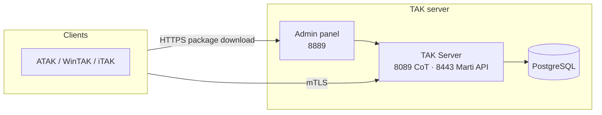

# 00 — Getting Started

Start here if you're taking over this TAK Server deployment today or seeing it for the first time.

## What this is

Official Java TAK Server 5.7, deployed in Docker containers, with a custom admin panel (WebUI) and package server. A self-hosted blue-force tracking / situational awareness network for ATAK, WinTAK, and iTAK clients.

No GitOps or continuous-sync layer: configuration lives in `takserver.env` on the server, and changes are applied by manual `git pull` + script runs (see [10-updates.md](10-updates.md)).

## System at a glance

## Don't

- Change `TAKSERVER_CERT_PASS` or `CA_PASS` without wiping the cert volume first — see [05-certificates-and-security.md](05-certificates-and-security.md).
- Run `docker compose up` by hand without `takserver.env` — use `./install.sh` or `make up`.
- Use `git add -A` / `git commit` without a clear reason — see the repo root `CLAUDE.md`.
- Run `update.sh` without a backup on a production deployment — see [08-backups.md](08-backups.md).

## By situation

| Situation | Document |
|---|---|
| Installing from scratch | [docs/INSTALL.md](INSTALL.md) (EN) or [docs/DIEGIMAS.md](DIEGIMAS.md) (LT) |
| Understanding how it all fits together | [01-architecture.md](01-architecture.md) |
| Adding/removing a user, plugin, or map | [04-day-to-day-operations.md](04-day-to-day-operations.md) |
| Something's broken | [09-troubleshooting.md](09-troubleshooting.md) |
| Restoring from a backup | [08-backups.md](08-backups.md) |
| Looking up a specific value (port, env var, command) | [11-technical-reference.md](11-technical-reference.md) |

Full document index: [docs/README.md](README.md).
