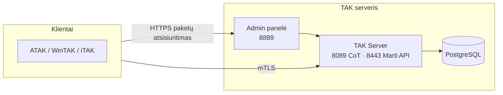

# 00 — Pradėti čia

Šis dokumentas — pirmas žingsnis, jei šį TAK Server diegimą perimate šiandien arba matote pirmą kartą.

## Kas tai yra

Oficialaus Java TAK Server 5.7 diegimas Docker konteineriuose, su savo administravimo skydeliu (WebUI) ir paketų serveriu. Skirtas savarankiškam (self-hosted) blue-force tracking / situacinio suvokimo tinklui — ATAK, WinTAK, iTAK klientams.

Nėra GitOps ar automatinio sinchronizavimo sluoksnio: konfigūracija gyvena `takserver.env` faile serveryje, o pakeitimai atliekami rankiniu `git pull` + skriptų paleidimu (žr. [10-atnaujinimai.md](10-atnaujinimai.md)).

## Minimali sistema vaizdas

## Ko nedaryti

- Nekeisti `TAKSERVER_CERT_PASS` ar `CA_PASS` be sertifikatų tomo (volume) išvalymo — žr. [05-sertifikatai-ir-saugumas.md](05-sertifikatai-ir-saugumas.md).
- Nedaryti rankinio `docker compose up` be `takserver.env` — naudoti `./install.sh` arba `make up`.
- Nenaudoti `git add -A` / `git commit` be aiškaus poreikio — žr. repo šaknies `CLAUDE.md`.
- Neatsisiųsti `update.sh` be atsarginės kopijos, jei diegimas produkcinis — žr. [08-atsargines-kopijos.md](08-atsargines-kopijos.md).

## Pagal situaciją

| Situacija | Dokumentas |
|---|---|
| Diegiu nuo nulio | [docs/INSTALL.md](INSTALL.md) (EN) arba [docs/DIEGIMAS.md](DIEGIMAS.md) (LT) |
| Noriu suprasti, kaip viskas susiję | [01-architektura.md](01-architektura.md) |
| Reikia pridėti/pašalinti naudotoją, papildinį, žemėlapį | [04-kasdieniai-darbai.md](04-kasdieniai-darbai.md) |
| Kažkas neveikia | [09-problemu-sprendimas.md](09-problemu-sprendimas.md) |
| Reikia atkurti iš atsarginės kopijos | [08-atsargines-kopijos.md](08-atsargines-kopijos.md) |
| Reikia konkrečios reikšmės (portas, env kintamasis, komanda) | [11-techninis-zinynas.md](11-techninis-zinynas.md) |

Pilnas dokumentų sąrašas: [docs/README.md](README.md).
