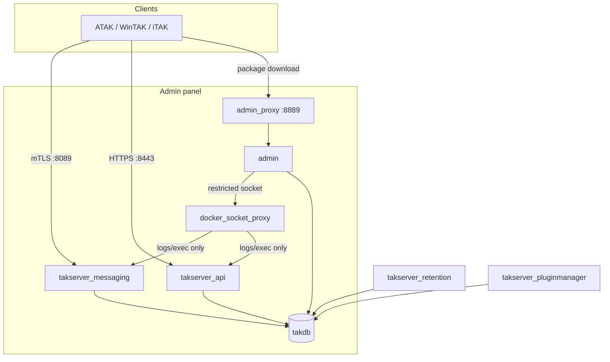

# 01 — Architecture

## Containers

| Container | Role |
|---|---|
| `takdb` | PostgreSQL + PostGIS — CoT and mission data |
| `tak_permissions` | Short-lived — TAK volume ownership migration on startup |
| `takserver_initialization` | One-shot — PKI generation, DB schema init |
| `takserver_config` | Main process — SSL CoT (8089), HTTPS Marti API (8443), federation (9000–9002) |
| `takserver_messaging` | Real-time CoT routing |
| `takserver_api` | REST API for mission packages, data feeds |
| `takserver_retention` | Prunes stale data per retention policy |
| `takserver_pluginmanager` | Server plugin lifecycle |
| `docker_socket_proxy` | Restricted Docker socket proxy — grants the admin panel logs/exec only, never container create/delete |
| `admin_permissions` | Short-lived — admin/nginx volume ownership migration |
| `admin` | Admin panel backend (FastAPI) — reachable only via `admin_proxy` |
| `admin_proxy` | TLS reverse proxy for the admin panel (8889) |

## Data flow

`admin_proxy` (nginx) is the only public TLS endpoint for the admin panel; the `admin` API is the only process with any access to the Docker socket, and only through `docker_socket_proxy`, which restricts it to logs/exec (see [05-certificates-and-security.md](05-certificates-and-security.md)).

## Networks

- `taknet` — every TAK + admin container.
- `docker_proxy_net` — isolated network between `admin` and `docker_socket_proxy`, so the Docker socket is never reachable from any other container.

## Client onboarding

Mutual TLS. Each user gets a signed certificate bundled into a TAK data package (`.zip`) containing server config, trust anchor, and ATAK preference defaults. Packages are downloaded over HTTP/HTTPS and imported directly into the TAK client — see [04-day-to-day-operations.md](04-day-to-day-operations.md).

## Admin panel

React + Vite UI (`admin/ui`), FastAPI backend (`admin/api`). Roles: `superadmin` / `admin` / `readonly` / `field`. Supports local password login or optional OIDC SSO (Keycloak/Authentik) — see [05-certificates-and-security.md](05-certificates-and-security.md).

Full repo layout — [02-repo-structure.md](02-repo-structure.md).
