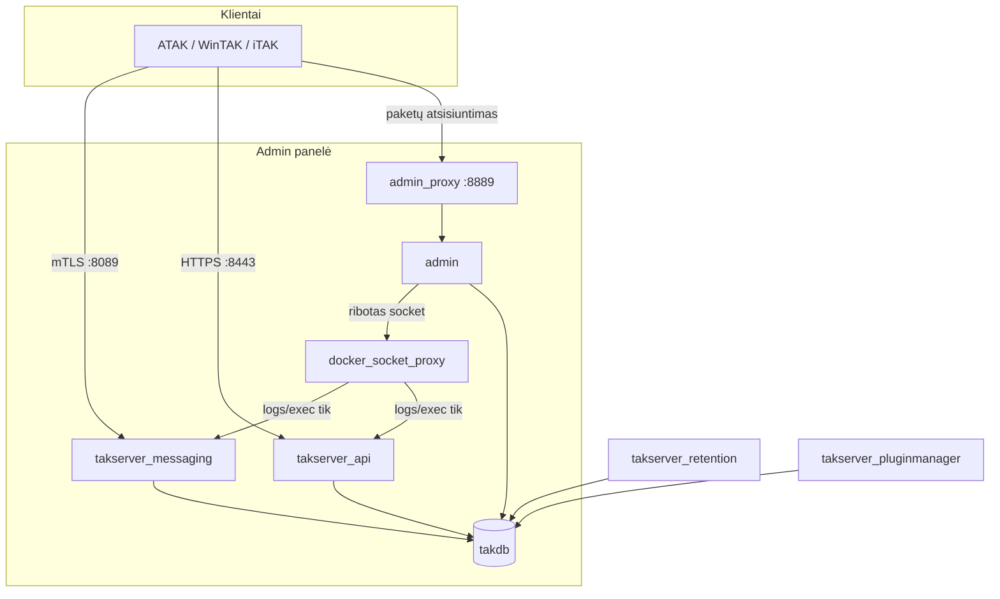

# 01 — Architektūra

## Konteinerių sąrašas

| Konteineris | Vaidmuo |
|---|---|
| `takdb` | PostgreSQL + PostGIS — CoT ir misijų duomenys |
| `tak_permissions` | Trumpalaikis — TAK tomo (volume) teisių migracija paleidimo metu |
| `takserver_initialization` | Vienkartinis — PKI generavimas, DB schemos inicializacija |
| `takserver_config` | Pagrindinis procesas — SSL CoT (8089), HTTPS Marti API (8443), federacija (9000–9002) |
| `takserver_messaging` | CoT maršrutizavimas realiuoju laiku |
| `takserver_api` | REST API misijų paketams, duomenų srautams |
| `takserver_retention` | Senų duomenų valymas pagal saugojimo politiką |
| `takserver_pluginmanager` | Serverio papildinių (plugin) gyvavimo ciklas |
| `docker_socket_proxy` | Ribotos prieigos Docker socket proxy — admin panelei leidžia tik logs/exec, ne konteinerių kūrimą/naikinimą |
| `admin_permissions` | Trumpalaikis — admin/nginx tomo teisių migracija |
| `admin` | Admin panelės backend (FastAPI) — pasiekiamas tik per `admin_proxy` |
| `admin_proxy` | TLS reverse proxy admin panelei (8889) |

## Duomenų srautas

`nginx` (admin_proxy) yra vienintelis viešas TLS galinis taškas admin panelei; `admin` API — vienintelis procesas, turintis prieigą prie Docker socket, ir tik per `docker_socket_proxy`, kuris apriboja API iki logs/exec (žr. [05-sertifikatai-ir-saugumas.md](05-sertifikatai-ir-saugumas.md)).

## Tinklai

- `taknet` — visi TAK + admin konteineriai.
- `docker_proxy_net` — izoliuotas tinklas tarp `admin` ir `docker_socket_proxy`, kad Docker socket nebūtų pasiekiamas iš kitų konteinerių.

## Klientų prisijungimas

Mutual TLS. Kiekvienas naudotojas gauna pasirašytą sertifikatą, supakuotą į TAK duomenų paketą (`.zip`) su serverio konfigūracija, patikimumo šaknimi (trust anchor) ir ATAK numatytaisiais nustatymais. Paketai atsisiunčiami per HTTP/HTTPS ir importuojami tiesiai į TAK klientą — žr. [04-kasdieniai-darbai.md](04-kasdieniai-darbai.md).

## Admin panelė

React + Vite UI (`admin/ui`), FastAPI backend (`admin/api`). Rolės: `superadmin` / `admin` / `readonly` / `field`. Palaiko lokalų slaptažodžio prisijungimą arba pasirenkamą OIDC SSO (Keycloak/Authentik) — žr. [05-sertifikatai-ir-saugumas.md](05-sertifikatai-ir-saugumas.md).

Pilnas repo katalogų sąrašas — [02-repo-struktura.md](02-repo-struktura.md).
