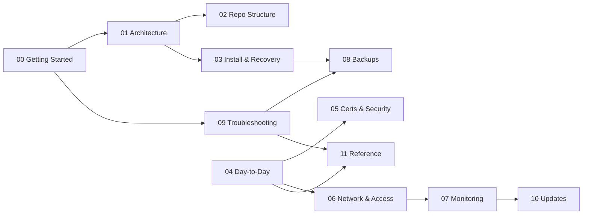

# Documentation

Operator manual for this TAK Server deployment. Each numbered guide exists in two languages — English (`NN-name.md`) and Lithuanian (`NN-pavadinimas.md`), same number, same content.

Default rule of thumb: read [00](00-getting-started.md) before anything else if this is new to you; jump straight to the topic doc if you already know the shape of the system.

## Where to start

| Situation | Document |
|---|---|
| First time seeing this repo | [00 — Getting Started](00-getting-started.md) · [00 — Pradėti čia](00-pradeti-cia.md) |
| Want to understand how it fits together | [01 — Architecture](01-architecture.md) · [01 — Architektūra](01-architektura.md) |
| Something's broken | [09 — Troubleshooting](09-troubleshooting.md) · [09 — Problemų sprendimas](09-problemu-sprendimas.md) |
| Need to change configuration / add a user | [04 — Day-to-Day Operations](04-day-to-day-operations.md) · [04 — Kasdieniai darbai](04-kasdieniai-darbai.md) |
| Need to restore data | [08 — Backups](08-backups.md) · [08 — Atsarginės kopijos](08-atsargines-kopijos.md) |
| Installing from scratch | [INSTALL.md](INSTALL.md) (EN) · [DIEGIMAS.md](DIEGIMAS.md) (LT) |

## Document map

## Full index

| # | English | Lithuanian | Type | About |
|---|---|---|---|---|
| 00 | [Getting Started](00-getting-started.md) | [Pradėti čia](00-pradeti-cia.md) | Start here | What this is, first orientation, don't-do list |
| 01 | [Architecture](01-architecture.md) | [Architektūra](01-architektura.md) | Explanation | Containers, data flow, networks |
| 02 | [Repo Structure](02-repo-structure.md) | [Repo struktūra](02-repo-struktura.md) | Reference | Directory layout, where to find things |
| 03 | [Installation and Recovery](03-installation-and-recovery.md) | [Diegimas ir atkūrimas](03-diegimas-ir-atkurimas.md) | Explanation | Install wizard overview, points to INSTALL/DIEGIMAS and to backups |
| 04 | [Day-to-Day Operations](04-day-to-day-operations.md) | [Kasdieniai darbai](04-kasdieniai-darbai.md) | How-to | Users, plugins, basemaps, status |
| 05 | [Certificates and Security](05-certificates-and-security.md) | [Sertifikatai ir saugumas](05-sertifikatai-ir-saugumas.md) | Explanation | mTLS, admin auth, socket isolation, federation |
| 06 | [Network and Access](06-network-and-access.md) | [Tinklas ir prieiga](06-tinklas-ir-prieiga.md) | Reference | VPN options, ports, package downloads |
| 07 | [Monitoring](07-monitoring.md) | [Stebėjimas](07-stebejimas.md) | Explanation | Dashboard, `health.sh`, audit, logs |
| 08 | [Backups](08-backups.md) | [Atsarginės kopijos](08-atsargines-kopijos.md) | How-to | What's backed up, restore procedure |
| 09 | [Troubleshooting](09-troubleshooting.md) | [Problemų sprendimas](09-problemu-sprendimas.md) | How-to | Common symptoms, fixes |
| 10 | [Updates](10-updates.md) | [Atnaujinimai](10-atnaujinimai.md) | How-to | `update.sh` flow, before/after checklist |
| 11 | [Technical Reference](11-technical-reference.md) | [Techninis žinynas](11-techninis-zinynas.md) | Reference | Ports, env vars, `make` commands, roles |

## Other documents in this repo

- [INSTALL.md](INSTALL.md) / [DIEGIMAS.md](DIEGIMAS.md) — full step-by-step installation guide (EN/LT). The numbered `03` doc is an overview that points here, not a duplicate.
- Repo root [README.md](../README.md), [SECURITY.md](../SECURITY.md), [CLAUDE.md](../CLAUDE.md), [AGENTS.md](../AGENTS.md) — always at the repo root, not here (tool/platform convention — GitHub, Claude Code, and other agents look for these specific filenames at the top level).
